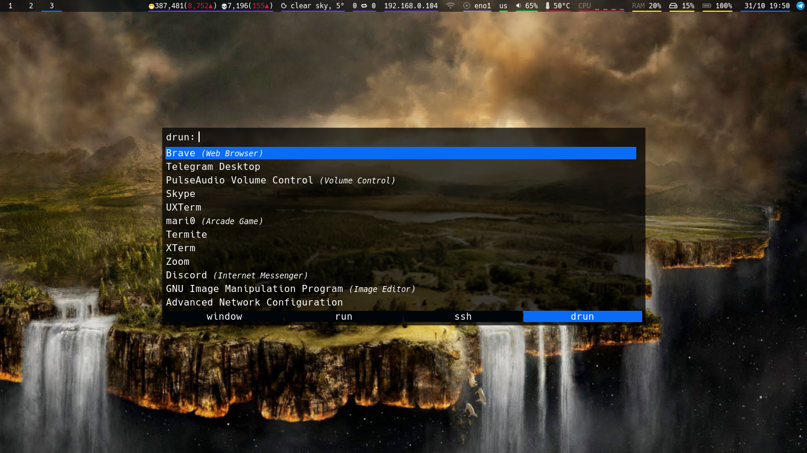
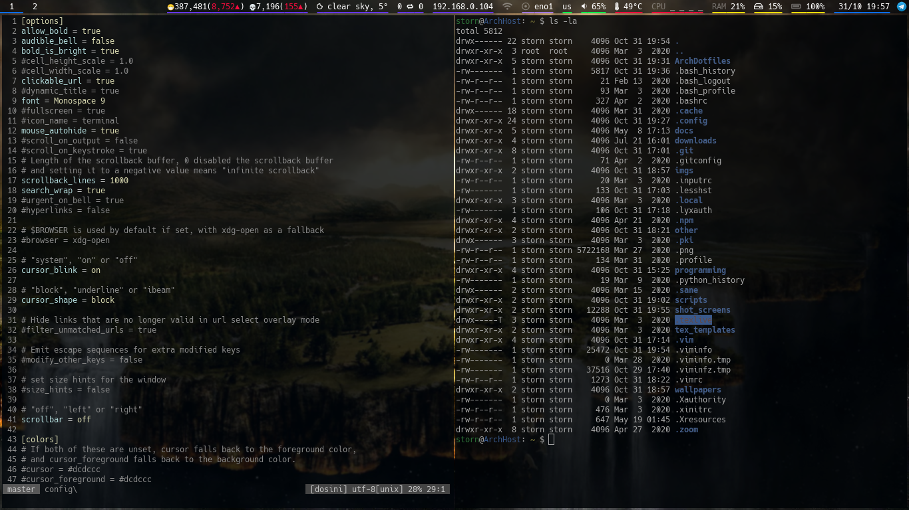
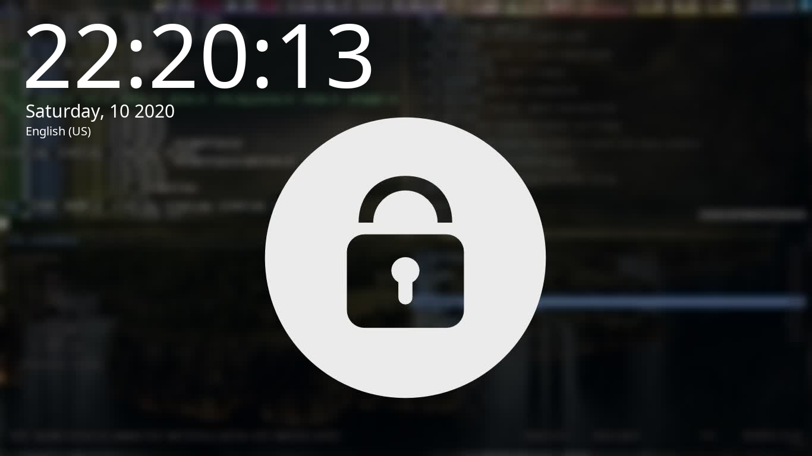

# Storn's Arch dotfile repo
Here, I store my Arch dotfiles for migrating between desktops.

## Software
This is the list of software I use these configs with:
- **Window manager**: i3-gaps
- **Display manager**: ly
- **Screen locker**: i3lock-color
- **Compositor**: picom
- **Bar**: Polybar
- **Sound server**: PulseAudio
- **Terminal**: Termite
- **Shell**: bash
- **File manager**: vifm
- **Window switcher**: rofi
- **Audio visualizer**: cava
- **PDF/DjVu viewer**: Zathura
- **Image viewer**: sxiv

## Useful info
- The script ```wallpaper.sh``` requires a folder with jpg images, numbered from 1.
- The script ```lock.sh``` requires ffmpeg & x11grab.
- The script ```weather.sh``` requires an API key from openweathermap. And you can change the city & country.
- You can change the country in ```corona.sh```.
- You can change the package manager in ```updates.sh```. The default one is yay.

## Shortcuts
The Windows key is used as the ```$mod``` key by default (can be changed in ```.config/i4/config```).

In "Default" mode:
- ```$mod D```: rofi
- ```$mod P```: import (screenshot)
- ```$mod Z```: vifm
- ```$mod Enter```: termite
- ```$mod S```: stacked layout
- ```$mod W```: tabbed layout
- ```$mod E```: toggle split
- ```$mod B```: horizontal split
- ```$mod V```: vertical split
- ```$mod F```: toggle fullscreen
- ```$mod Shift Space```: toggle floating window
- ```$mod 0-9```: switch workspace
- ```$mod Shift 0-9```: move window to workspace
- ```$mod R```: enter "Resize" mode
- ```$mod Q```: enter "System" mode

In "System" mode:
- ```L```: lock screen
- ```E```: exit (return to login)
- ```R```: reboot
- ```S```: shutdown
- Anything else: return to "Default" mode

## Screenshots
Searching for an app with rofi:


Working with vim & termite:


Lock screen:

